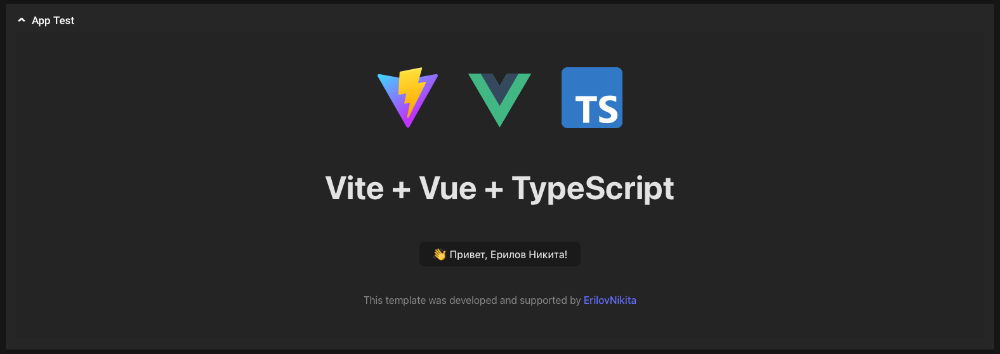

<p align="center">
  
  
  
</p>

<p align="center" style="margin-bottom: 80px; margin-top: 40px;">
  
  
  
</p>

<h2 align="center">✨ NSMP Embedded App Vue</h2>
<p>&nbsp;</p>

Этот шаблон должен помочь вам начать разработку встроенного приложения для Naumen Service Desk с Vue, TypeScript и Vite. 

Шаблон использует SFC `<script setup>` Vue 3, ознакомьтесь с [документацией по настройке скрипта](https://v3.vuejs.org/api/sfc-script-setup.html#sfc-script-setup), чтобы узнать больше.

## Тизер
> При установке новых и обновлении существующих завистимостей через `npm`, связанные кастомные завистимости отваливаются, и необходимо повторять данное действие, после любого взаимодействия с `npm`

Данный шаблон использует [собственную ветку](https://github.com/ErilovNikita/js-api) библиотеки `@nsmp/js-api`, поэтому позаботьтесь о ее наличии в своем проекте 

```sh
# Скачаиваем нужный проект
git clone https://github.com/ErilovNikita/js-api
# Переходим в дерикторию
cd js-api
# Устанавливаем связь с библиотекой
npm link
# Переходим в свой проект
cd ...
# Подключаем нашу кастомную библиотеку
npm link @nsmp/js-api
```

## Испрользование
### Режим разработки

В этом режиме появляется возможность запуска приложения вне сервиса Naumen Serivce Desk, для разработки или отладки.

##### Настройка
Для корректной работы в этом режиме необходимо создать файл `.env.development` и заполнить данные по примеру из файла `example.env`

##### Запуск
```sh
npm run dev
```

### Сборка приложения

До и после сборки нет необходимости что-то менять в коде встроенного приложения, во время сборки, замена всех переменных произойдет автоматически. Так же использование переменных окружения, не допустит попадения критичной информации в сборнный проект.

##### Запуск
```sh
npm run build
```

## Скриншоты
